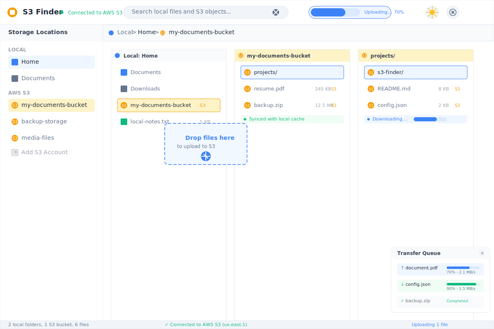

[](https://github.com/your-username/s3-finder)

# S3 Finder

A modern, cross-platform S3 object storage manager built with Rust, Tauri, and Leptos. S3 Finder provides an intuitive Miller column interface that allows you to manage S3 objects just like local files, with seamless interoperability between local and cloud storage.



## Design Goals

1. **Local-like S3 Management**: Use and manage S3 object storage with the same ease and familiarity as local file systems
2. **Seamless Interoperability**: Effortless file operations between local storage and S3 buckets
3. **Cross-Platform**: Native desktop application support for Windows, macOS, and Linux
4. **High Performance**: Optimized for fast operations with efficient data transfer and caching

## Features

- **Unified Interface**: Manage both local files and S3 objects in a single, intuitive Miller column layout
- **Drag & Drop**: Seamlessly drag files between local directories and S3 buckets
- **Batch Operations**: Upload, download, copy, and move multiple files efficiently
- **S3 Integration**: Full support for AWS S3 and S3-compatible storage services
- **Smart Sync**: Intelligent synchronization between local and remote storage
- **Multi-Account Support**: Manage multiple S3 accounts and regions simultaneously
- **File Preview**: Preview files directly from S3 without downloading
- **Search & Filter**: Advanced search across both local and S3 storage
- **Progress Tracking**: Real-time progress for uploads, downloads, and transfers
- **Bandwidth Control**: Configurable transfer speed limits and concurrent connections
- **Security**: Secure credential management with encryption at rest
- **Modern UI**: Clean, responsive interface with light/dark theme support

## Technology Stack

- **Frontend**: [Leptos](https://leptos.dev/) - Reactive web framework for Rust
- **Backend**: [Tauri](https://tauri.app/) - Rust-based desktop application framework
- **S3 SDK**: [AWS SDK for Rust](https://github.com/awslabs/aws-sdk-rust) - Official AWS SDK
- **Language**: Rust - Memory-safe systems programming language
- **Build Tool**: [Trunk](https://trunkrs.dev/) - WASM web application bundler

## Getting Started

### Prerequisites

- [Rust](https://rustup.rs/) (latest stable version)
- [Node.js](https://nodejs.org/) (for Tauri dependencies)
- [Trunk](https://trunkrs.dev/) for building the frontend
- AWS credentials configured (via AWS CLI, environment variables, or IAM roles)

### Installation

1. Clone the repository:
```bash
git clone https://github.com/your-username/s3-finder.git
cd s3-finder
```

2. Install dependencies:
```bash
cargo install trunk
```

3. Configure AWS credentials (choose one method):
```bash
# Method 1: AWS CLI
aws configure

# Method 2: Environment variables
export AWS_ACCESS_KEY_ID=your_access_key
export AWS_SECRET_ACCESS_KEY=your_secret_key
export AWS_DEFAULT_REGION=us-east-1

# Method 3: Use IAM roles (for EC2 instances)
```

4. Run in development mode:
```bash
trunk serve
```

5. Build for production:
```bash
trunk build --release
```

### Building Desktop Application

To build the native desktop application:

```bash
cd src-tauri
cargo tauri build
```

## Configuration

S3 Finder supports multiple configuration options:

### S3 Endpoints
- AWS S3 (default)
- MinIO
- DigitalOcean Spaces
- Wasabi
- Custom S3-compatible endpoints

### Performance Settings
- Concurrent upload/download connections
- Chunk size for multipart uploads
- Transfer speed limits
- Cache settings

## Development

### Project Structure

```
s3-finder/
├── src/                    # Frontend source code
│   ├── app.rs             # Main application component
│   ├── components/        # Reusable UI components
│   ├── services/          # S3 and file system services
│   │   ├── s3_service.rs  # S3 operations
│   │   └── file_service.rs # Local file operations
│   ├── types.rs           # Type definitions
│   └── utils/             # Utility functions
├── src-tauri/             # Tauri backend
│   ├── src/               # Rust backend code
│   │   ├── s3/           # S3 integration
│   │   └── commands/     # Tauri commands
│   └── tauri.conf.json    # Tauri configuration
├── styles.css             # Global styles
└── index.html             # HTML template
```

### Code Quality

Run linting and formatting:

```bash
cargo clippy --all-targets --all-features -- -D warnings
cargo fmt
```

### Testing

Run tests:

```bash
cargo test
```

For integration tests with S3:

```bash
# Set up test S3 bucket
export TEST_S3_BUCKET=your-test-bucket
cargo test --features integration-tests
```

## Usage Examples

### Basic Operations

1. **Connect to S3**: Add your AWS credentials in the settings
2. **Browse Buckets**: Navigate through your S3 buckets using the column interface
3. **Upload Files**: Drag files from local directories to S3 buckets
4. **Download Files**: Drag files from S3 buckets to local directories
5. **Sync Folders**: Right-click on folders to sync between local and S3

### Advanced Features

- **Multi-region Support**: Switch between different AWS regions
- **Bucket Policies**: View and manage bucket permissions
- **Lifecycle Rules**: Configure object lifecycle management
- **Versioning**: Access and manage object versions

## Contributing

1. Fork the repository
2. Create a feature branch (`git checkout -b feature/amazing-feature`)
3. Commit your changes (`git commit -m 'Add some amazing feature'`)
4. Push to the branch (`git push origin feature/amazing-feature`)
5. Open a Pull Request

## License

This project is licensed under the MIT License - see the [LICENSE](LICENSE) file for details.

## Recommended IDE Setup

[VS Code](https://code.visualstudio.com/) + [Tauri](https://marketplace.visualstudio.com/items?itemName=tauri-apps.tauri-vscode) + [rust-analyzer](https://marketplace.visualstudio.com/items?itemName=rust-lang.rust-analyzer).
